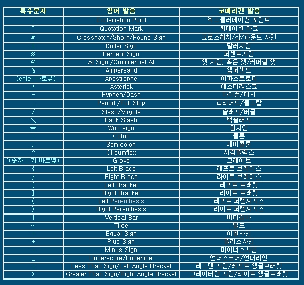

# git-bash 용어 익히기


### 경로이동

* **pwd** = 현재 프로그램이 열려있는 경로 상태 파악
* **cd ..** = 상위폴더로 이동


* **cd 폴더** = 현위치에 존재하고있는 폴더로 이동
* **cd 폴더/하위폴더**=현위치에서 존재하고 있는 폴더에서 하위에 있는 폴더로 이동
* **cd ~** = 시스템이 설정되어진 최상위 폴더로 이동
* **cd d:** = D드라이브로 이동


### 생성/삭제

* **rm** = 폴더,파일 관계없이 삭제하는 기능 
* **rm -r** = 강제삭제
* **mkdir** = 현위치에 폴더생성
* **touch** = 현위치에 파일생성


### 기타

* **ls** = 현재 폴더위치에서 들어있는 폴더/파일의 내용을 목록으로 보여주는 기능

* `clear` = git-bash 사용시 하단까지 내용이 있을 경우 화면을 정리하는 기능

* **&&**= 두 가지 이상의 기능을 사용할 때 중간연결기능

  `mkdir testBox && touch testBox/mkfile.md`

  ```
  mkdir testBox
  touch tsetBox/mkfile.md
  ```


## tip: 키보드 명칭체크

